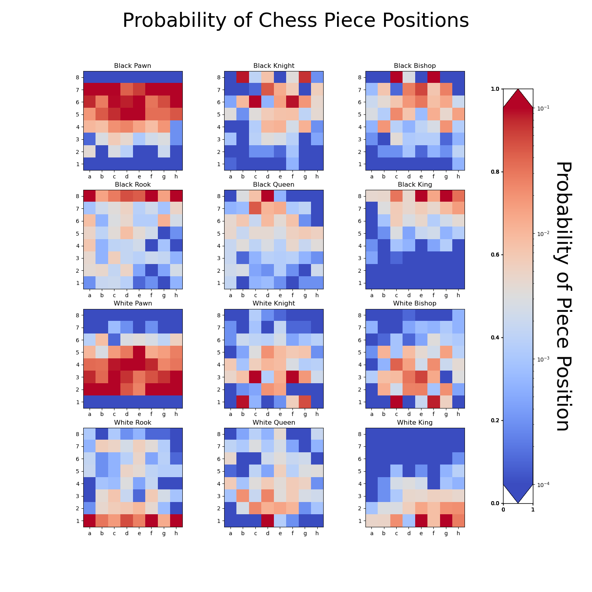
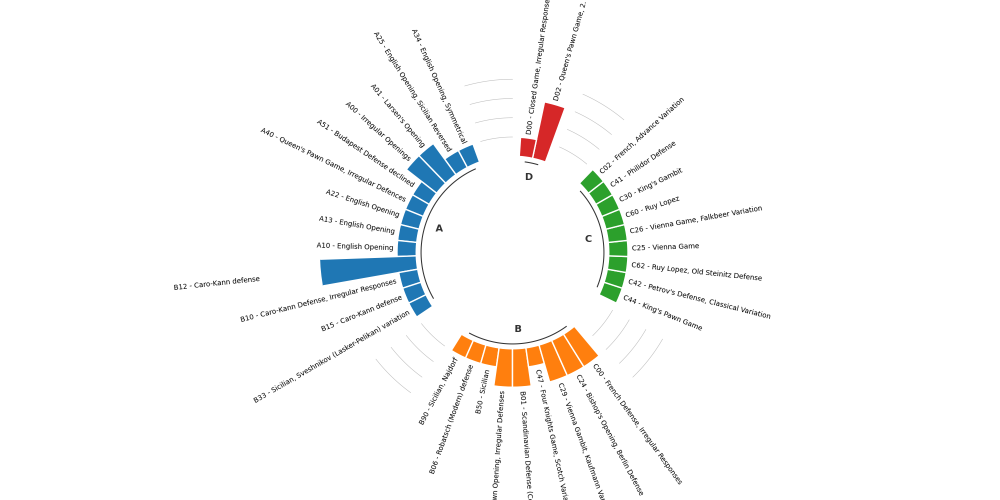

# Scacchi Poldo
Analisi delle partite del sociale 2022

Le partite sono state raccolte in uno studio Lichess 
https://lichess.org/study/XqUzpHu5/Opshh99a

ed alcuni dati, tra cui l'accuratezza e l'imprecisione indotta, sono stati elaborati in Google Sheet 
https://docs.google.com/spreadsheets/d/1_35OvRNVHcvqgEJQq0coMX1KOUjcKED5pgQn1r50sx4/edit?usp=share_link

mentre per alcune elaborazioni grafiche è stato utilizzato Python
https://htmlpreview.github.io/?https://github.com/nomeutentepippo/scacchi_poldo_sociale/blob/main/images/chess_opening_graph.html

